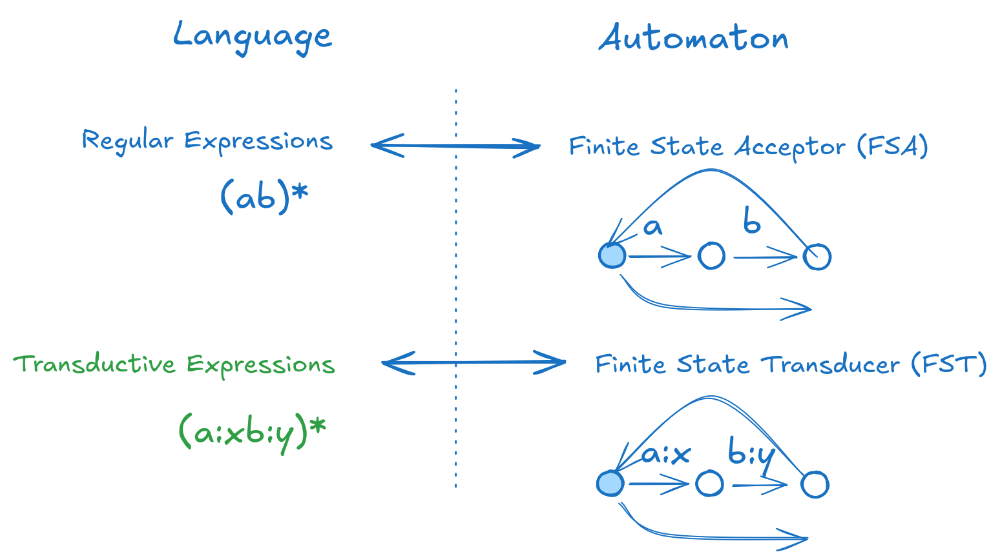
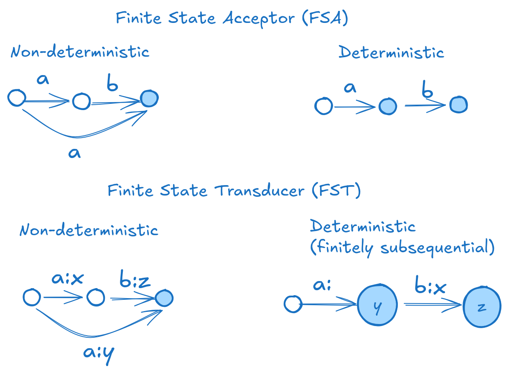

# TRRE: transductive regular expressions

#### TLDR: It is an extension of the regular expressions for text editing and a `grep`-like command line tool.
#### It is a PROTOTYPE. Do not use in production.

## Intro



Regular expressions is a great tool for searching patterns in text. But I always found it unnatural for text editing. The *group* logic works as a post-processor and can be complicated. Here I propose an extension to the regular expression language for pattern matching and text modification. I call it **transductive regular expressions** or simply **`trre`**.

It  introduces the `:` symbol to define transformations. The simplest form is `a:b`, which replaces a with b. I call this a `transductive pair` or `transduction`.

To demonstrate the concept, I have created a command line tool **`trre`**. It feels similar to the `grep -E` command.

## Examples

### Basics

To change `cat` to `dog` we use the following expression:

```bash
$ echo 'cat' | trre 'c:da:ot:g'
dog
```

A more readable version:

```bash
$ echo 'cat' | trre '(cat):(dog)'
dog
```

It can be used like `sed` to replace all matches in a string:

```bash
$ echo 'Mary had a little lamb.' | trre '(lamb):(cat)'
Mary had a little cat.
```

**Deletion:**

```bash
$ echo 'xor' | '(x:)or' 'xor'
cat
```

The expression `(x:)` could be interpreted as of translation of `x` to an empty string.

**Insertion:**

```bash
$ echo 'or' | trre '(:x)or'
xor
```

We could think of the expression `(:x)` as of translation of an empty string into `x`.

### Regex over transductions

As for normal regular expression we could use **alternations** with `|` symbol:

```bash
$ echo 'cat dog' | trre 'c:bat|d:hog'
bat hog
```

Or use the **star** over `trre` to repeat the transformation:

```bash
$ echo 'catcatcat' | trre '((cat):(dog))*'
dogdogdog
```

In the default `scan` mode, **star** can be omitted:

```bash
$ echo 'catcatcat' | trre '(cat):(dog)'
dogdogdog
```

You can also use the star in the left part to "consume" a pattern infinitely:

```bash
$ echo 'catcatcat' | trre '(cat)*:(dog)'
dog
```

#### Danger zone

Avoid using `*` or `+` in the right part, as it can cause infinite loops:

```bash
$ echo '' | trre ':a*'      # <- do NOT do this
dog
```

Instead, use finite iterations:

```bash
$ echo '' | trre ':(repeat-10-times){10}'
dog
```

### Range transformations

Transform ranges of characters:

```bash
$ echo "regular expressions" | trre  "[a:A-z:Z]"
REGULAR EXPRESSIONS
```

As more complex example, lets create a toy cipher. Below is the Caesar cipher(1) implementation:

```bash
$ echo 'caesar cipher' | trre '[a:b-y:zz:a]'
dbftbs djqifs
```

And decrypt it back:

```bash
$ echo 'dbftbs djqifs' | trre '[a:zb:a-y:x]'
caesar cipher
```

### Generators

**`trre`** can generate multiple output strings for a single input. By default, it uses the first possible match. You can also generate all possible outputs.

**Binary sequences:**
```bash
$ echo '' | trre -g '(0|1){3}'
000
001
010
011
100
101
110
111
```

**Subsets:**
```bash
$ echo '' | trre -g ':(0|1){,3}?'

0
00
000
001
01
010
011
1
10
100
101
11
110
111
```

## Language specification

Informally, we define a **`trre`** as a pair `pattern-to-match`:`pattern-to-generate`. The `pattern-to-match` can be a string or regexp. The `pattern-to-generate` normally is a string. But it can be a `regex` as well. Moreover, we can do normal regular expression over these pairs.

We can specify a smiplified grammar of **`trre`** as following:

```
TRRE    <- TRRE* TRRE|TRRE TRRE.TRRE
TRRE    <- REGEX REGEX:REGEX
```

Where `REGEX` is a usual regular expression, and `.` stands for concatenation.

For now I consider the operator `:` as non-associative and the expression `TRRE:TRRE` as unsyntactical. There is a natural meaning for this expression as a composition of relations defined by **`trre`**s. But it can make things too complex. Maybe I change this later.


## Why it works

Under the hood, **`trre`** constructs a special automaton called a **Finite State Transducer (FST)**, which is similar to a **Finite State Automaton (FSA)** used in normal regular expressions but handles input-output pairs instead of plain strings.

Key differences:

* **`trre`** defines a binary relation between two regular languages.

* It uses **FST**s instead of **FSA**s for inference.

* It supports on-the-fly determinization for performance (experimental and under construction!).

To justify the laguage of trunsductive regular expression we need to prove the correspondence between **`trre`** expressions and the corresponding **FST**s. There is my sketch of a the proof: [theory.pdf](theory.pdf).

## Design choices and open questions

There are tons of decisions:

* Associativity of `:`. The `:` symbol is non-associative, meaning a:b:c is invalid in the current version. There is a natural meaning of transducer composition but it could make things too complicated. Alternative syntaxes (e.g., > and <) could be explored.

* Precedence of `:`. The priority of : in expressions needs clarification.

* Implicit Epsilon: should there be an explicit symbol?

## Modes and greediness

**`trre`** supports two modes:

* **Scan Mode (default)**: Applies transformations sequentially.

* **Match Mode**: Checks the entire string against the expression (use `-m` flag).

Use `-a` to generate all possible outputs.

The `? modifier makes `*`, `+`, and `{,}` operators non-greedy:

```bash
$ echo '<cat><dog>' | trre '<(.:)*>'
<>

$ echo '<cat><dog>' | trre '<(.:)*?>'
<><>
```

## Determinization



The important part of the modern regex engines is determinization. This routine converts the non-deterministic automata to the deterministic one. Once converted it has linear time inference on the input string length. It is handy but the convertion is exponential in the worst case.

For **`trre`** the similar approach is possible. The bad news is that not all the non-deterministic transducers (**NFT**) can be converted to a deterministic (**DFT**). In case of two "bad" cycles with same input labels the algorithm is trapped in the infinite loop of a state creation. There is a way to detect such loops but it is expensive (see more in [Allauzen, Mohri, Efficient Algorithms for testing the twins property](https://cs.nyu.edu/~mohri/pub/twins.pdf)).

## Performance

The NFT (non-deterministic) version is a bit slower then `sed`:

```bash
$ wget https://www.gutenberg.org/cache/epub/57333/pg57333.txt -O chekhov.txt

$ time cat chekhov.txt | trre '(vodka):(VODKA)' > /dev/null

real	0m0.046s
user	0m0.043s
sys	0m0.007s

$ time cat chekhov.txt | sed  's/vodka/VODKA/' > /dev/null

real	0m0.024s
user	0m0.020s
sys	0m0.010s

```

For complex tasks, **`trre_dft`** (deterministic version) can outperform sed:

```bash
$ time cat chekhov.txt | sed -e 's/\(.*\)/\U\1/' > /dev/null

real	0m0.508s
user	0m0.504s
sys	0m0.015s

$ time cat chekhov.txt | trre_dft '[a:A-z:Z]' > /dev/null

real	0m0.131s
user	0m0.127s
sys	0m0.009s
```

## Installation

No pre-built binaries are available yet. Clone the repository and compile:

```bash
git clone git@github.com:c0stya/trre.git trre
cd trre
make && sh test.sh
```

Then move the binary to a directory in your `$PATH`.

## TODO

* Complete the ERE feature set:
    - negation `^` within `[]`
    - character classes
    - '$^' symbols
* Full unicode support
* Efficient range processing
* Stable DFT version

## References

* The approach is strongly inspired by Russ Cox article: [Regular Expression Matching Can Be Simple And Fast](https://swtch.com/~rsc/regexp/regexp1.html)
* The idea of transducer determinization comes from this paper: [Cyril Allauzen, Mehryar Mohri, "Finitely Subsequential Transducers"](https://research.google/pubs/finitely-subsequential-transducers-2/)
* Parsing approach comes from [Double-E algorithm](https://github.com/erikeidt/erikeidt.github.io/blob/master/The-Double-E-Method.md) by Erik Eidt which is close to the classical [Shunting Yard algorithm](https://en.wikipedia.org/wiki/Shunting_yard_algorithm).
